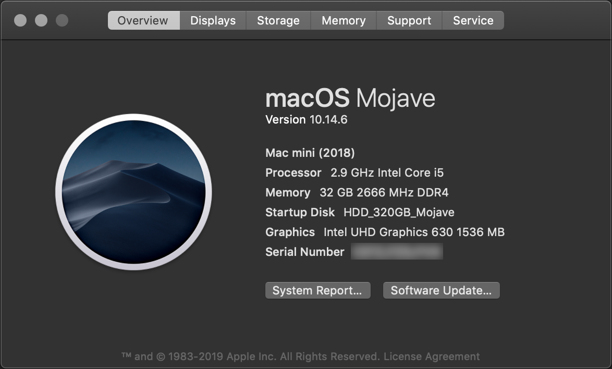

# macOS-Mojave-Comet-Lake

Is there a reason to pay $1900 for Mac mini 2018 if a very similar system can be build 1/3 of the price with a possibility to install a pretty descent dGPU?

Let us know if you are fond of soldered SSD and a generous option of upgrading from 8GB DDR4-2666 to 32GB for $600.

This guideline covers specifics of macOS installation on a system with recent [Comet Lake](https://ark.intel.com/content/www/ru/ru/ark/products/codename/90354/comet-lake.html) CPUs.

Unfortunately the latest Catalina release 10.15.6 proved to have numerous annoying bugs and issues. Since it also lacks 32-bit support while not offering any deal-breaking features the previous Mojave 10.14.6 release appears preferable for the time being.

The list of hardware:

| HW | Details | P/N |
| --- | --- | --- |
| CPU | Intel 6C-12T-12M-2.9GHz-4.3GHz | [i5-10400](https://ark.intel.com/content/www/us/en/ark/products/199271/intel-core-i5-10400-processor-12m-cache-up-to-4-30-ghz.html) |
| MB | ASUS ROG STRIX H470-I GAMING | [H470-I](https://www.asus.com/Motherboards/ROG-STRIX-H470-I-GAMING/) |
| RAM | Crucial Ballistix DDR4-2666 16GB x 2 | [BL2K16G26C16U4B](https://www.crucial.com/memory/ddr4/bl2k16g26c16u4b) |
| HDD | Seagate 2.5" 7200rpm 320GB SATA3 | [ST9320423AS](https://www.seagate.com/staticfiles/support/disc/manuals/notebook/momentus/7200.4%20(Holliday)/100534376a.pdf) |
| SSD | Samsung 860 EVO 1TB SATA6 | [MZ-76E1T0BW](https://www.samsung.com/semiconductor/minisite/ssd/product/consumer/860evo/) |
| PSU | OCZ 550W | OCZ550FTY |
| CASE | Thermaltake F1 Supressor | [CA-1E6-00S1WN-00](https://www.thermaltake.com/suppressor-f1.html) |

Luckily Mojave does include support for Macmini8,1 which sports a pretty similar (aside from extra 300Mhz) Coffee Lake CPU -- 6C-12T-12M-3.2GHz-4.6GHz -- [i7-8700B](https://ark.intel.com/content/www/us/en/ark/products/134905/intel-core-i7-8700b-processor-12m-cache-up-to-4-60-ghz.html).

[OpenCore 0.6.1](https://github.com/acidanthera/OpenCorePkg/releases) -- up to date bootloader

[Dortania Project](https://dortania.github.io/OpenCore-Install-Guide/config.plist/comet-lake.html) -- excellent guide

macOS / Windows BT pairing procedure -- mostly from [Soorma07](https://github.com/Soorma07/OS-X-Bluetooth-Pairing-Value-To-Windows-Value):

1.	Download [PsExec](https://docs.microsoft.com/en-us/sysinternals/downloads/psexec) command line tool from Sysinternals package to access registry as SYSTEM
2.	Boot to Windows 10 and pair BT device
3.	Run "psexec -s -i regedit" as Administrator and export the key to REG-file:
	`HKLM\SYSTEM\CurrentControlSet\Services\BTHPORT\Parameters\Keys\BD_ADDR`
4.	Reboot to macOS and pair BT device
5.	Export the the key:
	`sudo defaults read /private/var/root/Library/Preferences/com.apple.bluetoothd.plist LinkKeys`
6.	Replace the key value in the original REG-file with the one from macOS -- use reversed byte order, i.e.
	`00010203 04050607 08090a0b 0c0d0e0f` > `0f0e0d0c 0b0a0908 07060504 03020100`

